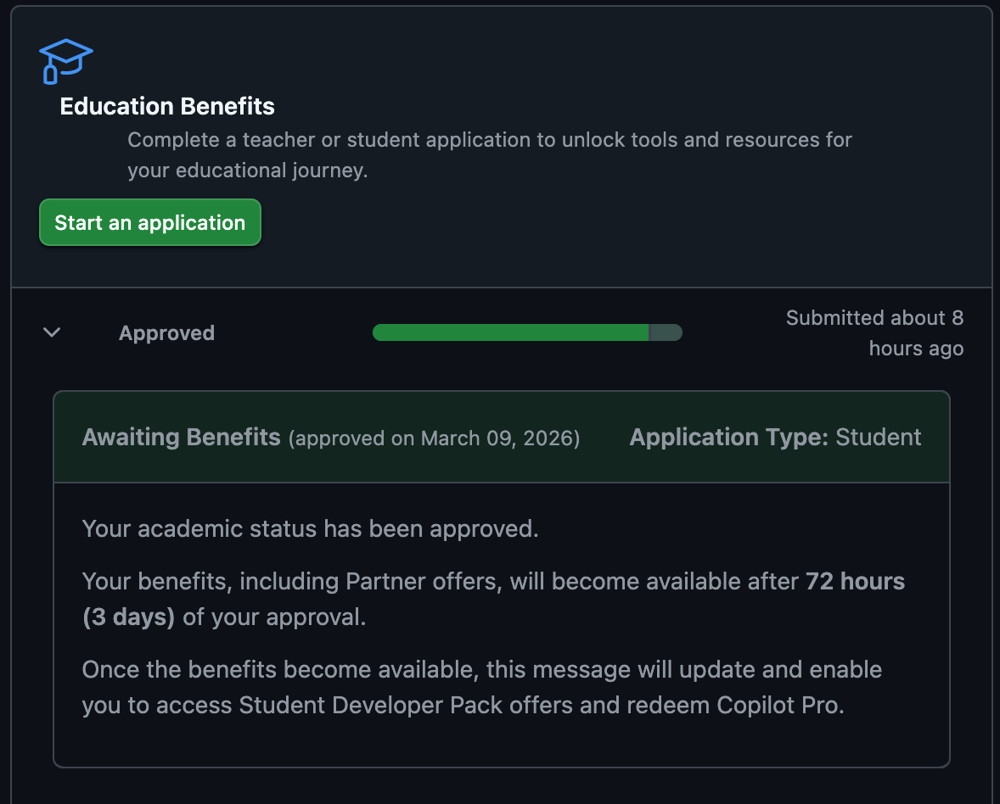

# Reflection on W07 Introduction to Positron

This reflection summarizes what I learned from the Positron module, including the interface, AI tools, and how Positron compares to RStudio.

::: callout-note
Positron is a next generation data science IDE developed by Posit that integrates features from RStudio and VS Code while introducing AI assisted workflows.
:::

# Essay Prompts

## Prompt 1

**Download and Install Positron. As you watch the videos in Step 1 and Step 3, follow the activities in the video and be familiar with Positron.**

I downloaded and installed Positron and followed along with the tutorial videos provided in the module. While watching the walkthrough, I explored the interface and practiced basic tasks such as opening a project, running code, and viewing variables. This helped me become familiar with the Positron environment before moving on to the other exercises.

## Prompt 2

**Based on what you learned from Step 1 and Step 3, what do you like about Positron compared with RStudio?**

One thing I liked about Positron compared to RStudio is the clean and modern interface. The layout makes it easy to organize files, view variables, and run code in the console while keeping everything visible in one workspace. I know that RStudio already automates many tasks and has helpful built in tools, but Positron seems to take that a step further by integrating AI suggestions and assistance directly into the workflow. The ability for AI tools to explain code, suggest solutions, and help troubleshoot problems could make the coding process faster and more efficient.

Overall, Positron feels like an updated environment that builds on the strengths of RStudio while introducing newer tools that support its data science workflows.

## Prompt 3

**In Step 4, the video demonstrates how you can use AI.**

### 3.1 Describe the various ways you can use AI inside Positron.

AI can be used in several ways inside Positron. One way is through AI assistants that can help explain code, generate code suggestions, and assist with debugging when errors occur. These AI tool can also provide inline suggestions while writing code, which helps speed up the development process by predicting what the user may want to write next. In addition, some features can even help summarize data or assist with exploratory data analysis. These tools can make it easier to work through coding problems and better understand how different parts of a program function during development.

### 3.2 Which AI tools have you installed or set up? Which AI tools did you find beneficial for you?

For this module, I set up GitHub Copilot as an AI coding assistant and connected it to Positron through the GitHub authentication process. Copilot is designed to suggest code while you are typing and generate possible solutions when working through programming tasks, which can potentially make the development process faster. The Positron Assistant, which works through Copilot, can also help explain code and assist with debugging directly inside the IDE. Although I was able to authenticate Copilot, the assistant tool took a long time to initialize and did not fully load during my testing, which made it difficult to fully explore the features. Even so, the concept of AI assistance inside the development environment seems useful for guiding users through coding problems and suggesting possible approaches.

### 3.3 GitHub Copilot Reflection

After attempting to use GitHub Copilot through the Positron Assistant, I noticed that the tool took a long time to initialize and remained in a loading state during my testing. Because of this, I was not able to fully experiment with the assistant features inside Positron. In this case, the experience felt somewhat distracting since the tool did not respond as expected.

Even though I was not able to fully test it, the idea behind Copilot still seems useful. An AI assistant that can suggest code, explain functions, and help troubleshoot errors could make programming faster and easier when it works properly. Overall, I think Copilot has the potential to be helpful, but the reliability of the integration will be important for it to become a consistent part of the workflow.

## Prompt 4

**Publish this report to GitHub Pages and provide a URL to the GitHub Pages for the report.**

GitHub Pages URL: